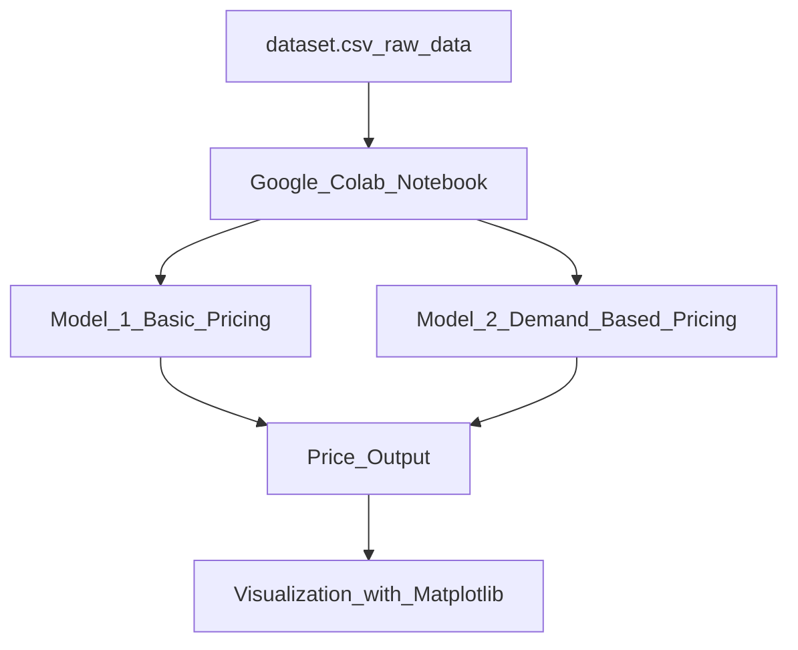

# 🚗 Dynamic Pricing System for Urban Parking Lot Optimization

This project was developed as part of the **Summer Analytics 2025 Capstone Program** hosted by the **Consulting & Analytics Club, IIT Guwahati** in collaboration with **Pathway**.

## 1. Overview

The project presents a dynamic pricing system for managing urban parking lots. The aim is to enhance space utilization and optimize revenue by adjusting prices in real time based on:

- Traffic congestion
- Occupancy
- Special events
- Vehicle type
- Time of day

The system is implemented using Python in a Google Colab environment. Output trends are visualized using Matplotlib. The architecture is modular and can be extended to real-time streaming applications using **Pathway**.

## 2. Tech Stack Used

- **Programming Language:** Python  
- **Libraries:** Pandas, NumPy, Matplotlib  
- **Visualization:** Matplotlib  
- **Streaming & Real-Time (Optional):** Pathway  
- **Development Environment:** Google Colab  
- **Diagram Tool:** Mermaid.js  

## 3. Project Architecture and Workflow

### 3.1 Workflow

1. **Input Data**  
   The system uses `dataset.csv`, containing fields like occupancy, queue length, vehicle type, traffic level, special day, and timestamp.

2. **Data Preprocessing**  
   The data is cleaned and structured for modeling. Categorical variables are encoded where needed.

3. **Pricing Models**
   - **Model 1: Basic Pricing**  
     Uses a simple linear formula based on occupancy rate.
   - **Model 2: Demand-Based Pricing**  
     Includes traffic, queue length, special events, and vehicle type for smarter pricing.
   - **(Optional) Model 3: Competitive Pricing**  
     Considers nearby parking lots (lat-long) and competitor prices.

4. **Price Output**  
   Each row outputs a dynamic parking price.

5. **Visualization**  
   Real-time price comparison between models using line charts (Matplotlib).

### 3.2 Architecture Diagram (Mermaid)

## 4. 📁 Repository Structure
.
├── dataset.csv
├── Dynamic_Pricing_Parking_YourName.ipynb
├── README.md
└── (Optional) report.pdf

---

## 5. 🏃‍♂️ How to Run

1. Open the notebook in [Google Colab](https://colab.research.google.com)
2. Upload `dataset.csv`
3. Run all code cells in order
4. View the price predictions and visualizations

---

## 📣 Author

Developed by me as part of the **Summer Analytics 2025** capstone program at **IIT Guwahati**, hosted by the **Consulting & Analytics Club** in collaboration with **Pathway**.
